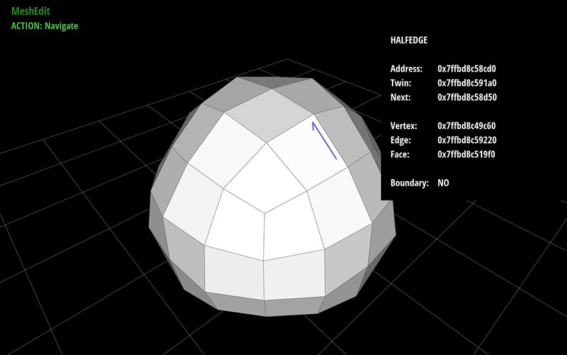
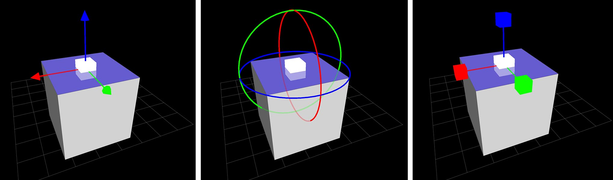
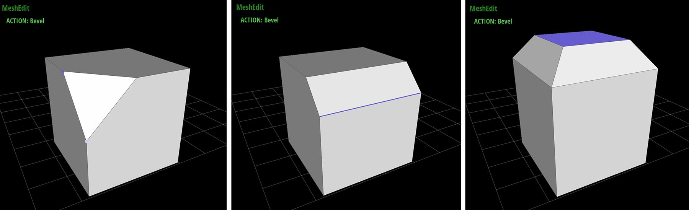
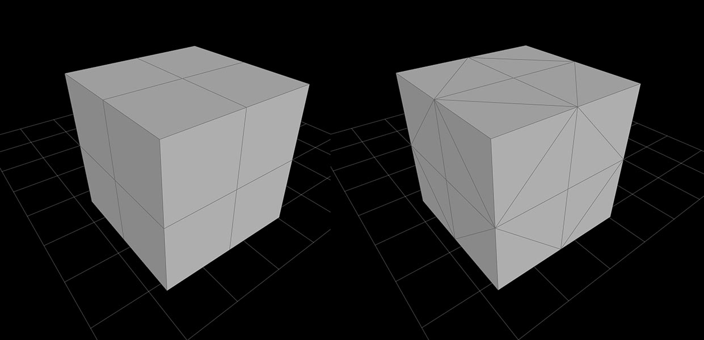
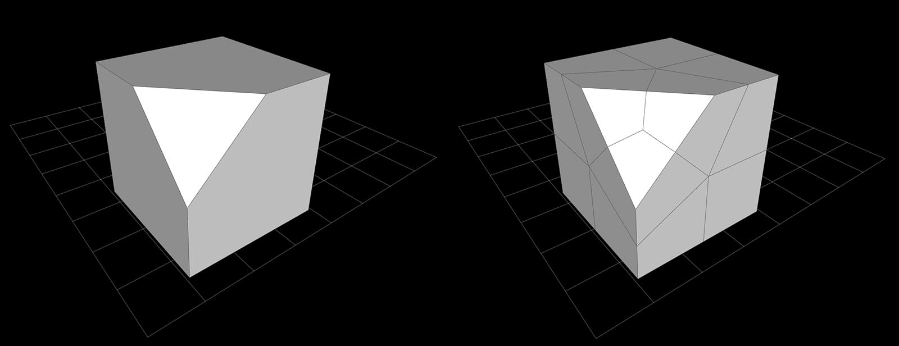
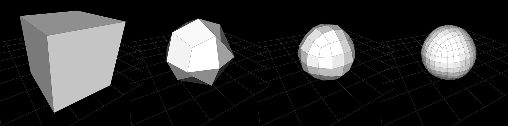
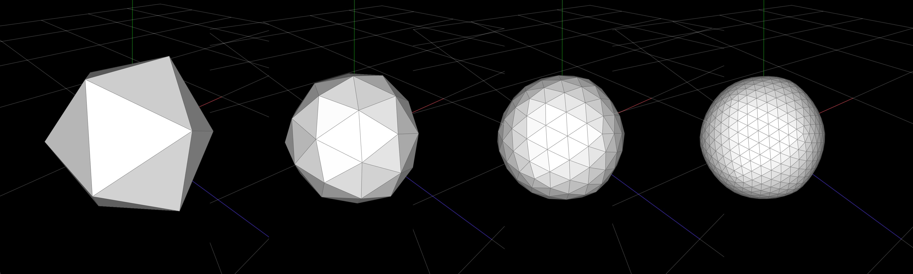
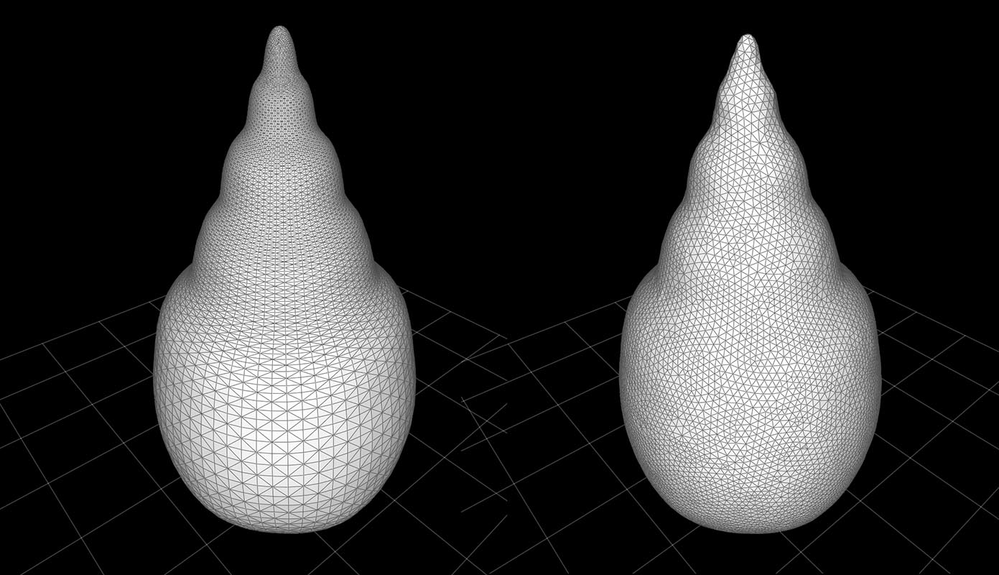
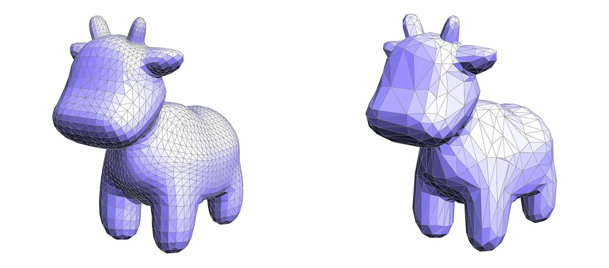

# Scotty3D

[http://15462.courses.cs.cmu.edu/fall2016/](http://15462.courses.cs.cmu.edu/fall2016/)

Scotty3D is a full-featured software package for 3D modeling, rendering, and animation.  The only problem is that we've removed most of the features! :-)

Your job throughout the remainder of the semester is to bring Scotty3D to life by implementing core functionality.  This task has been broken up into three different assignments, where you will implement the _MeshEdit_, _PathTracer_, and _Animate_ modules.  Thankfully, basic file parsing and GUI functionality (which is a total pain to write!) has already been implemented for you, so that you can focus on the core graphics tasks.

The documentation below provides some end-user information on how to _use_ Scotty3D.  Additional developer information will be provided with the assignments.

## Overview

### Modes and Actions

The basic paradigm in Scotty3D is that there are three different _modes_, each of which lets you perform certain _action_.  For instance, in MeshEdit mode, you can perform actions associated with modeling.  When in Animator mode you can perform actions associated with animation.  Etc.  Within a given mode, you can switch between actions by hitting the appropriate key; keyboard commands are listed below for each mode.  Note that _the input scheme may change depending on the mode_.  For instance, key commands in MeshEdit mode may result in very different actions in PathTracer mode.

The current mode and action are displayed in the upper-left corner of the screen.

### Scene Buffers

Rather than a standard "undo/redo" paradigm, Scotty3D allows you to quickly load and write the scene to numbered _buffers_ that can be quickly and easily swapped out.  Therefore, rather than having a linear history of all your edits, you can store interesting intermediate results, possibly coming back to them later.

In the Scotty3D interface there are 10 buffers, associated with the keys `0` through `9`.  To write the current scene to a buffer, you simply press the `w` key, followed by the buffer number you want to write to.  For instance, `w` and then `3` will write to buffer number three.  Likewise, to load a scene from a buffer, you press `l` (i.e., lowercase L) and then a number. _Note that loading a buffer will overwrite the current scene!_  If you want to preserve the current scene for later use, you should write it into an unused buffer before loading an earlier buffer.  Likewise, writing into a previously-used buffer will overwrite the contents of that buffer.  Finally, loading from an unused buffer will have no effect (the scene will remain unchanged).

Another nice feature of the buffer system in Scotty3D is that it is persistent across different sessions, i.e., if you quit Scotty3D (or it crashes...) you can still load your stored scenes from the buffers when you restart the program.  (These buffered scenes are stored as COLLADA files named `Scotty3D_bufferN.dae` in the same directory from which you execute Scotty3D, which means you can also copy them or open them in other applications.)

## MeshEdit

When in MeshEdit mode, Scotty3D provides a polygon-based 3D modeler with basic subdivision capabilities.  The central modeling paradigm is "box modeling", i.e., starting with a simple cube, you can add progressively more detail to produce interesting 3D shapes.  You can also use _subdivision_ to get smooth approximations of these shapes.

MeshEdit supports three actions (NAVIGATE, EDIT, and BEVEL), plus a collection of mesh editing commands that are available from any mode.

Note that MeshEdit (and more broadly, Scotty3D) will only operate on meshes that are _manifold_ (i.e., the union of faces containing any given vertex _v_ is a topological disk).  Likewise, all mesh operations in Scotty3D will preserve the manifold property, i.e., manifold input will always get mapped to manifold output.  This property is key for ensuring that many algorithms in Scotty3D are "well-behaved", and that it always produces nice output for other programs to use.

### NAVIGATE

In this mode you can move the camera around, and inspect mesh elements by left-clicking on vertices, edges, faces, and halfedges.  Information about these elements (including debugging information) will be shown in the _info panel_ in the upper-right region of the screen.  The camera can be manipulated in three ways:
   * _Rotate_ - left-clicking on the background (i.e., not on any scene object) and dragging will rotate the scene.
   * _Zoom_ - using the scroll wheel, or scrolling on your trackpad, will zoom the scene in and out.
   * _Translate_ - right-clicking on the background (or using multi-touch on a trackpad, e.g., two-finger click-and-drag) will translate the camera around the scene.

### EDIT
   
In this mode you can change the geometry (i.e., the shape) of a mesh by clicking and dragging on mesh elements (vertices, edges, faces, and halfedges).  Clicking and dragging will translate an element in directions parallel to the view plane.  Clicking on an element will also invoke a _transformation widget_, which allows elements to be manipulated with a respect to a particular coordinate axis.  Note that the transformation widget has three modes of operation, which you can toggle through either by (i) repeatedly pressing the `e` key, or (ii) holding down a modifier key:
   * _Translate (control)_ - move the selected element along X, Y, and Z axes.  Clicking the handle in the center will perform a free-translate (parallel to the screen).
   * _Rotate (alt/option)_ - rotate the selected element around X, Y, and Z axes.
   * _Scale_ (shift) - perform a nonuniform scale along X, Y, and Z axes.  Clicking the handle in the center will scale the element uniformly.

   Note that on some platforms, the modifier keys may not be interpreted properly---in this case, you can still access the three tranformation modes by repeatedly pressing the `e` key.

### BEVEL
   
The bevel action creates a new copy of the selected element that is inset and offset from the original element.  Clicking and dragging on an element will perform a bevel; the horizontal motion of the cursor controls the amount by which the new element shrinks or expands relative to the original element, and the vertical motion of the cursor controls the amount by which the new element is offset (in the normal direction) from the original element.  It is important to note that a new element will be created upon click _even if no inset or offset is applied_.  Therefore, if you're not careful you may end up with duplicate elements that are not immediately visible.  (To check, you can drag one of the vertices in Edit mode.)

   

   There are three possible types of bevels:

* **VertexBevel** - The selected vertex _v_ is replaced by a face _f_ whose vertices are connected to the edges originally incident on _v_.  The new face is inset (i.e., shunken or expanded) by a user-controllable amount, and also offset by a user-controllable amount in the normal direction (not shown here).
   
  

* **EdgeBevel** - The selected edge _e_ is replaced by a face _f_ whose vertices are connected to the edges originally incident on the endpoints of _e_.  The new face is inset and offset by some user-controllable amount, as with the vertex bevel.
   
  

* **FaceBevel** - The selected face _f_ is replaced by a new face _g_, as well as a ring of faces around _g_, such that the vertices of _g_ connect to the original vertices of _f_.  The new face is inset and offset by some user-controllable amount.

  

### CONNECTIVITY EDITING
   
In addition to beveling, a variety of commands can be used to alter the connectivity of the mesh (for instance, splitting or collapsing edges).  These commands are applied by selecting a mesh element (in any mode) and pressing the appropriate key, as listed below.  Local mesh editing operations include:

* **EraseVertex** - The selected vertex _v_ together with all incident edges and faces will be replaced with a single face _f_, that is the union of all faces originally incident on _v_.

  

* **EraseEdge** - The selected edge _e_ will be replaced with the union of the faces containing it, producing a new face _e_ (if _e_ is a boundary edge, nothing happens).

  

* **EdgeCollapse** - The selected edge _e_ is replaced by a single vertex _v_. This vertex is connected by edges to all vertices previously connected to either endpoint of _e_.  Moreover, if either of the polygons containing _e_ was a triangle, it will be replaced by an edge (rather than a degenerate polygon with only two edges).

  

* **FaceCollapse** - The selected face _f_ is replaced by a single vertex _v_.  All edges previously connected to vertices of _f_ are now connected directly to _v_.

  

* **EdgeFlip** - The selected edge _e_ is "rotated" around the face, in the sense that each endpoint moves to the next vertex (in counter-clockwise order) along the boundary of the two polygons containing _e_.

  

* **EdgeSplit** - [Note: this method is for triangle meshes only!] The selected edge _e_ is split at its midpoint, and the new vertex _v_ is connected to the two opposite vertices (or one in the case of a surface with boundary).

  

### GLOBAL MESH PROCESSING
   
A number of commands can be used to create a more global change in the mesh (e.g., subdivision or simplification).  These commands can be applied by selecting any element in the target mesh (in any mode) and pressing the appropriate key.  Note that in scenes with multiple meshes (e.g., those used by the PathTracer), this command will be applied only to the selected mesh.

* **Triangulate** - Each polygon is split into triangles.

  

* **Linear subdivision** - Each polygon in the selected mesh is split into quadrilaterals by inserting a vertex at the midpoint and connecting it to the midpoint of all edges.  New vertices are placed at the average of old vertices so that, e.g., flat faces stay flat, and old vertices remain where they were.

  

* **Catmull-Clark subdivision** - Just as with linear subdivision, each polygon is split into quadrilaterals, but this time the vertex positions are updated according to the [Catmull-Clark subdivision rules](https://en.wikipedia.org/wiki/Catmull–Clark_subdivision_surface), ultimately generating a nice rounded surface.

  

* **Loop subdivision** - _[Note: this method is for triangle meshes only!]_ Each triangle is split into four by connecting the edge midpoints.  Vertex positions are updated according to the [Loop subdivision rules](https://en.wikipedia.org/wiki/Loop_subdivision_surface).

  

* **Isotropic Remeshing** - _[Note: this method is for triangle meshes only!]_ The mesh is resampled so that triangles all have roughly the same size and shape, and vertex valence is close to regular (i.e., about six edges incident on every vertex).

  

* **Simplification** - _[Note: this method is for triangle meshes only!]_ The number of triangles in the mesh is reduced by a factor of about four, aiming to preserve the appearance of the original mesh as closely as possible.

  

### KEY COMMANDS

Key                  | Action
---------------------|-----------------------------------------------------------
`space`              | switch to navigate mode
`tab`                | show/hide info panel
hold `control`       | temporarily switch to translation in edit mode
hold `shift`         | temporarily switch to scaling in edit mode
hold `alt`/`option`  | temporarily switch to rotation in edit mode
`e`                  | cycle through **(e)**dit modes
`b`                  | toggle **b**evel mode
`n`                  | select **n**ext halfedge
`t`                  | select **t**win halfedge
`h`                  | select **h**alfedge of current element
`T`                  | **T**riangulate mesh
`s`                  | **s**ubdivide Catmull-Clark
`S`                  | **S**ubdivide linear
`backspace`/`delete` | erase selected edge
`f`                  | **f**lip selected edge
`c`                  | **c**ollapse selected edge
`p`                  | s**p**lit selected edge _triangle meshes only!_
`u`                  | **u**psample _triangle meshes only!_
`i`                  | **i**sotropic remesh _triangle meshes only!_
`d`                  | **d**ownsample _triangle meshes only!_
`w` then `0`--`9`    | **w**rite scene to numbered buffer
`l` then `0`--`9`    | **l**oad scene from numbered buffer

## PathTracer

_Coming soon._

## Animator

_Coming soon._

